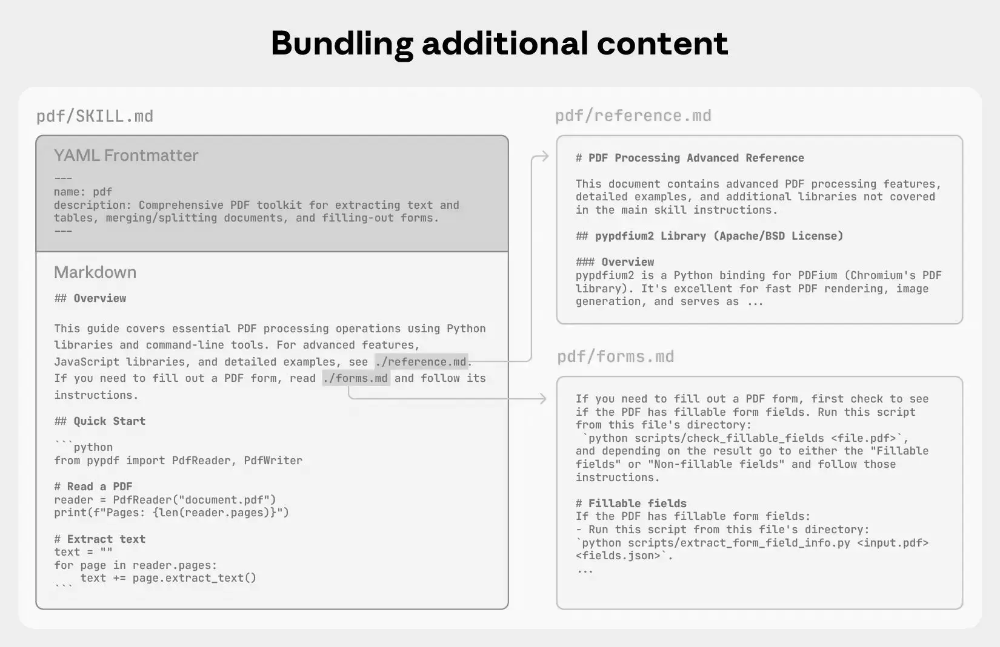

# Architektur statt Chaos: Eine moderne Skill-Library für Claude Code & co

> [README](../README_de.md) | [KATALOG](CATALOG_de.md) | [SKILLS-EXPLAINED](SKILLS-EXPLAINED_de.md) | **ARTICLE**

> [!NOTE]
> Dieses Repo enthält Anthropics Implementierung von Skills für Claude. Alle Skills folgen dem offenen [Agent Skills Standard](https://agentskills.io).

### TL;DR

- **Drei Ebenen statt einer Datei** — Rules (immer geladen) + Skills (bei Bedarf) + Agents (isolierte Subprozesse)
- **Skills, Agents, Rules** — ein Baukasten, kein Framework. Pro Projekt kopieren, was man braucht (siehe [KATALOG](CATALOG_de.md) für aktuelle Zahlen)
- **Agent-"Seelen" schlagen platte Labels** — Forschung zeigt: Experiential Identities verbessern die Accuracy um 10-60%
- **Skills lehren, Agents handeln** — Skills laden Wissen in den aktuellen Kontext, Agents laufen in Isolation
- **Weniger ist mehr** — gehe bedacht damit um, welche Skills und Agents du installierst. Jeder Header kostet Token bei jedem Call

### Inhalt

1. [Chaos](#chaos) — Das Problem mit kopierten Configs
2. [Drei Ebenen, ein Repo](#drei-ebenen-ein-repo) — Rules, Skills, Agents getrennt
3. [Rules](#rules-was-claude-immer-wissen-muss) — Vier Dateien, vier Domains, keine Überschneidungen
4. [Skills lehren, Agents handeln](#skills-lehren-agents-handeln) — Die Unterscheidung, die den Unterschied macht
5. [Seele](#gib-dem-agenten-keine-platte-rolle-gib-ihm-eine-seele) — Experiential Identities statt platter Labels
6. [Workflow Skills](#workflow-skills-skills-die-agents-steuern) — Skills die Agents orchestrieren
7. [Agent Teams](#agent-teams-wenn-subagents-nicht-reichen) — Wenn Subagents nicht reichen
8. [Ralph Loop](#advanced-ralph-loop--autonome-arbeitsschleifen) — Autonome Iterationsschleifen
9. [Context Management](#context-management-all-diese-skills-aber-bitte-nicht-alle-gleichzeitig) — Welche Skills man tatsächlich installieren sollte
10. [Wie man es nutzt](#wie-man-es-nutzt) — Workflow für die Übernahme der Library
11. [Was ich falsch gemacht habe](#was-ich-anfangs-falsch-gemacht-habe) — Lessons aus dem Aufbau
12. [Closing](#closing)

## Chaos

<p align="center"></p>

<p align="center"><em>Fünf Projekte, fünf divergierende Configs — das Problem, das diese Library löst.</em></p>

Du kennst das. Du startest ein neues Projekt und legst als Erstes eine frische CLAUDE.md Konfigurationsdatei an. Um Zeit zu sparen, kopierst du deine Standard-Regeln aus einem alten Projekt herüber: "Never log PII", "Type hints mandatory". Das Problem: Du passt die Regeln im Laufe der Zeit in den verschiedenen Projekten isoliert an. Drei Monate später hast du fünf Projekte mit fünf völlig unterschiedlichen Versionen deiner "Standard-Regeln" – und ein absolutes Chaos.

Oder: Du baust einen Custom Agent für Security Reviews. Du gibst ihm den System-Prompt "You are an expert security reviewer." Er läuft, er findet ein paar Sachen — aber die Analyse liest sich genauso generisch wie ohne System-Prompt. Was fehlt?

Oder: Du hast Skills und Agents im gleichen Ordner, behandelst sie gleich, und wunderst dich, warum manche gut funktionieren und manche nicht. Dabei sind es fundamental verschiedene Dinge.

Ich habe mir irgendwann die Frage gestellt: Was wäre, wenn ich die generischen Teile meiner Claude-Code-Konfiguration einmal richtig aufbaue und dann in jedes Projekt mitnehme? Nicht als monolithisches Framework, sondern als Baukasten — universelle Regeln, abrufbares Wissen und delegierte Expertise sauber getrennt.

Das Ergebnis ist eine Skill-Library mit Rules, Skills, Agents und einem CLAUDE.md Template. Es hat verändert, wie jedes meiner Projekte mit Claude arbeitet. Nicht weil die einzelnen Teile so besonders wären, sondern weil die Trennung von Regeln, Wissen und Expertise stimmt.

---

## Drei Ebenen, ein Repo

Die Library trennt drei Concerns, die in den meisten Setups vermischt werden:

**Rules** sind universelles Verhalten. Sie sind immer geladen, in jedem Projekt, bei jedem Prompt. Vier Dateien: Coding Conventions, Agent Behavior, Security, Self-Improvement.

**Skills** sind abrufbares Wissen. Sie werden geladen, wenn sie relevant sind — wie ein Handbuch aufschlagen. Skills in vier Kategorien.

**Agents** sind delegierte Expertise mit eigenem Scope. Sie laufen als isolierte Subprozesse, bekommen null Kontext vom Parent-Process und liefern ein Ergebnis zurück. Agents in vier Kategorien.

Hier das vollständige Verzeichnis-Layout:

```
skill-library/
├── docs/                             # CATALOG + ARTICLE (EN + DE)
├── templates/
│   └── CLAUDE.md.template
├── rules/                            # Immer geladenes Verhalten
│   ├── coding-conventions.md
│   ├── agent-behavior.md
│   ├── security.md
│   └── self-improvement.md
├── skills/
│   ├── meta/                         # Skills, Agents und Teams bauen
│   │   ├── skill-builder/
│   │   ├── agent-builder/
│   │   └── team-builder/
│   ├── build/
│   │   ├── frontend/                 # Design & Components
│   │   │   ├── frontend-design/
│   │   │   └── warmgold-frontend/
│   │   └── backend/                  # Scaffolding & Infrastruktur
│   │       ├── prompt-builder/
│   │       ├── logging-builder/
│   │       ├── config-builder/
│   │       ├── exception-builder/
│   │       ├── docker-builder/
│   │       ├── ci-cd-builder/
│   │       └── project-scaffold/
│   ├── workflow/                     # Multi-Agent Workflows
│   │   ├── plan-review/
│   │   ├── session-verify/
│   │   ├── pr-review/
│   │   ├── tdd/
│   │   ├── deep-research/
│   │   ├── ralph-loop/
│   │   └── ralph-loop-prompt-builder/
│   └── patterns/                     # Architektur-Patterns
│       ├── di-container/
│       ├── protocol-design/
│       ├── strategy-registry/
│       ├── error-handling/
│       ├── resilience-patterns/
│       ├── testing-patterns/
│       ├── api-design/
│       └── systematic-debugging/
└── agents/
    ├── review/                       # Code Review & Audit
    │   └── reviewer.md
    ├── analyze/                      # Analyse & Erkennung
    │   └── analyzer.md
    ├── plan/                         # Planung & Bewertung
    │   └── planner.md
    └── build/                        # Code-Generierung & Modifikation
        ├── code-simplifier.md
        └── test-architect.md
```

> [!NOTE]
> Der `code-simplifier` Agent basiert auf dem, den [Boris Cherny](https://x.com/bcherny/status/2009450715081789767) (Erfinder von Claude Code) aus dem internen Workflow des Claude-Code-Teams open-sourced hat.

Der entscheidende Punkt: **Rules ersetzen den generischen Teil von CLAUDE.md.** Sobald du grundlegende Standards wie DRY, Security und das Agenten-Verhalten als Rules ausgelagert hast, braucht deine CLAUDE.md nur noch das, was dein Projekt wirklich einzigartig macht. Das DRY-Prinzip, angewandt auf AI-Konfiguration.

### Die Library als Referenz-Sammlung

Keine nervigen Installs oder Setup-Skripte. Diese Library ist als reines Nachschlagewerk und Baukasten einfach aber effektiv gehalten. Für jedes Projekt suchst du in den Kategorien und kopierst, was du brauchst:

Projekt A ist eine reine Python-API und braucht den Analyzer-Agent, aber sicher keinen Frontend-Design-Skill. Projekt B ist ein Frontend und braucht genau das Gegenteil. Kein Projekt schleppt Agents mit, die es nicht nutzt. So behältst du die Kontrolle über die Abhängigkeiten deines Projekts.

Dein Agent kann sich Skills auch direkt aus dem GitHub-Repo holen — ohne lokalen Clone. Ein einfacher Aufruf reicht:

```
Lies https://github.com/101mare/skill-library/blob/main/docs/CATALOG.md und kopiere den tdd Skill in mein Projekt
```

Alternativ kannst du die Library einmal klonen und dann lokal referenzieren:

```bash
git clone https://github.com/101mare/skill-library.git ~/skill-library
```

> [!IMPORTANT]
> **Kernaussage:** Trenne universelles Verhalten, abrufbares Wissen und delegierte Arbeit — dann braucht deine CLAUDE.md nur noch das Projektspezifische.

Die drei Ebenen sind definiert. Schauen wir uns jede einzelne an — angefangen beim Fundament.

---

## Rules: Was Claude immer wissen muss

<p align="center"></p>

<p align="center"><em>Vier Rules, vier Domains: Conventions, Behavior, Security, Self-Improvement.</em></p>

Vier Rules, vier Domains, keine Überschneidungen.

### `coding-conventions.md` — Wie Code aussehen soll

DRY, Types, Error Handling, Testing. Der wichtigste Satz darin:

> DRY applies to knowledge, not code. If two functions have identical lines but represent different domain concepts, they are NOT duplicates. Forcing them into one abstraction creates coupling that makes future changes harder.

Ohne diese Unterscheidung produziert Claude Abstraktionen, die zwei Zeilen Code sparen und ein paar Monate später mehr verwirren statt zu helfen.

### `agent-behavior.md` — Wie Claude arbeiten soll

Read first, Scope Discipline, minimale Änderungen.

> Read first, write second: Always read existing code before modifying. Understand patterns before proposing changes.

> Three similar lines are better than a premature helper.

> Ask, don't assume: When in doubt, ALWAYS ask. Better to ask once too many than to implement incorrectly.

### `security.md` — Was nie verhandelbar ist

Input Validation, PII-freies Logging, Secrets in Environment-Variablen, keine neuen Dependencies ohne Rückfrage.

### `self-improvement.md` — Der Feedback-Loop

Nach jeder Korrektur das Pattern in `.claude/memory.md` capturen — nicht die einzelne Korrektur, sondern das generelle Prinzip dahinter. Am Session-Start die Lessons reviewen. Wenn der gleiche Fehler zweimal passiert, war die Lesson nicht spezifisch genug.

---

Warum genau diese vier? Coding Conventions verhindern stilistischen Drift. Agent Behavior verhindert Scope Creep — das häufigste Problem bei AI-generiertem Code. Security verhindert die Bugs, die am schwersten zu finden sind. Self-Improvement sorgt dafür, dass Claude aus Korrekturen lernt statt sie zu wiederholen.

Diese vier Dateien bilden ab sofort das Fundament für jedes neue Projekt.

> [!IMPORTANT]
> **Kernaussage:** Vier Dateien, vier Domains, null Überschneidungen — Coding-Standards, Agent-Verhalten, Security und Self-Improvement bilden das unveränderliche Fundament.

Rules setzen die Baseline. Aber die eigentliche Stärke kommt aus dem Zusammenspiel der anderen beiden Ebenen.

---

## Skills lehren, Agents handeln

<p align="center"></p>

<p align="center"><em>Skills laden Wissen in den aktuellen Kontext. Agents laufen in isolierten Subprozessen.</em></p>

Das ist die Unterscheidung, die den größten Unterschied macht.

**Skills** sind Wissen im aktuellen Kontext. Wenn Claude einen Skill lädt, ist das wie ein Handbuch aufschlagen — die Information ist sofort verfügbar, im gleichen Kontext, ohne Handoff-Verlust. Skills eignen sich für Patterns, Scaffolding-Rezepte, Workflows.

(Kurzer Exkurs: "Scaffolding" bezeichnet das automatische Hochziehen eines Projekt-Grundgerüsts, z.B. das Generieren der initialen Ordnerstruktur, Config-Dateien und Basis-Klassen, bevor der eigentliche Code geschrieben wird).

**Agents** sind isolierte Subprozesse. Sie bekommen einen Auftrag, eigene Tools und null Kontext vom Eltern-Prozess. Das ist wie einen Spezialisten beauftragen — er bringt eigene Expertise mit, sieht aber nur, was du ihm explizit gibst.

### Die vier Kategorien

Vier Skill-Kategorien:

**meta/** (3 Skills) — Die Library kann sich selbst erweitern. `skill-builder`, `agent-builder` und `team-builder` lehren Claude, neue Skills, Agents und Agent Teams nach den richtigen Patterns zu erstellen.

**build/** (9 Skills) — Unterteilt in `frontend/` und `backend/`. Frontend: Frontend Design, Warmgold Design System. Backend: Config (Pydantic + YAML + Env-Vars), Logging, Exceptions, Docker, CI/CD (GitHub Actions), Prompts, Projektstruktur.

**workflow/** (7 Skills) — Orchestrierung von Multi-Agent Workflows: Plan Review vor der Implementierung, Session Verification nach der Arbeit, PR Review für Pull Requests, TDD (RED-GREEN-REFACTOR Zyklus), Deep Research (strukturierte Recherche vor technischen Entscheidungen), Ralph Loop (autonome Iterationsschleife via Hooks) und Ralph Loop Prompt Builder (interaktiver Prompt-Builder dafür).

**patterns/** (8 Skills) — Wiederverwendbare Architektur-Patterns: DI Container, Protocol Design, Strategy + Registry, Error Handling, Resilience Patterns (Retry, Circuit Breaker, Timeout), Testing Patterns (pytest + Hypothesis), API Design (FastAPI), Systematic Debugging (4-Phasen-Methodik).

### Das SKILL.md Format

> [!NOTE]
> Für eine konzeptionelle Einführung, *warum* Skills funktionieren — Progressive Disclosure, Dateisystem-Struktur und gebündelte Ressourcen — siehe [SKILLS-EXPLAINED_de.md](SKILLS-EXPLAINED_de.md). Dieser Abschnitt behandelt das *praktische Wie*.

Skills sind Ordner mit Instruktionen, Skripten und Ressourcen, die Claude dynamisch lädt, um bei spezialisierten Aufgaben besser zu arbeiten. Skills lehren Claude, bestimmte Aufgaben wiederholbar zu erledigen — sei es Dokumente nach den Markenrichtlinien deines Unternehmens zu erstellen, Daten mit den spezifischen Workflows deiner Organisation zu analysieren oder persönliche Aufgaben zu automatisieren.

Weiterführende Informationen:

- [What are skills?](https://support.claude.com/en/articles/12512176-what-are-skills)
- [Using skills in Claude](https://support.claude.com/en/articles/12512180-using-skills-in-claude)
- [How to create custom skills](https://support.claude.com/en/articles/12512198-how-to-create-custom-skills)
- [Equipping agents for the real world with Agent Skills](https://claude.com/blog/equipping-agents-for-the-real-world-with-agent-skills)

### Einen einfachen Skill erstellen

Ein Skill ist ein Ordner mit einer `SKILL.md` Datei — YAML Frontmatter plus Instruktionen. Das Grundgerüst sieht so aus:

```yaml
---
name: my-skill-name
description: A clear description of what this skill does and when to use it
---

# My Skill Name

[Add your instructions here that Claude will follow when this skill is active]

## Examples
- Example usage 1
- Example usage 2

## Guidelines
- Guideline 1
- Guideline 2
```

Das Frontmatter braucht nur zwei Felder:

- **`name`** — Eindeutiger Identifier (lowercase, Bindestriche)
- **`description`** — Vollständige Beschreibung, was der Skill tut und wann er zum Einsatz kommt

Wichtig: Die Skill-Header (`name` + `description`) werden Claude **immer** im Prompt mitgegeben — so weiß er bei jedem Task, welche Skills verfügbar sind und wann er sie laden soll. Der vollständige Inhalt der SKILL.md wird erst geladen, wenn der Skill relevant wird.

> [!TIP]
> Du willst, dass Claude Skills für dich baut? Der `skill-builder` Meta-Skill lehrt Claude das SKILL.md-Format, Frontmatter-Konventionen und Best Practices — so kannst du einfach sagen "erstelle einen Skill für X" und bekommst ein sauber strukturiertes Ergebnis.

### Wie Skill Loading tatsächlich funktioniert

Das Matching ist rein prompt-basiert — kein Embedding-Lookup, keine Magie. Claude liest alle installierten Skill-Beschreibungen und entscheidet selbst, ob ein Skill relevant ist. Das passiert **proaktiv**: Du musst nicht `/skill-name` tippen. Wenn du schreibst "warum schlägt dieser Test fehl?", matcht Claude das gegen die Trigger-Phrasen in `systematic-debugging` und lädt den Skill selbstständig. Oder du fängst an über API-Endpunkte zu reden und Claude lädt `api-design` ohne danach gefragt worden zu sein.

Wenn Claude einen Skill lädt, liest er die `SKILL.md` per Read-Tool — das ist **sichtbar** in der Konversation. Es ist kein stiller Hintergrundprozess; du siehst den Tool-Call passieren.

Die Schwäche: Das Matching ist nur so gut wie die Beschreibungen. Wenn Trigger-Phrasen zu generisch sind, lädt Claude den falschen Skill oder gar keinen. Wenn sie zu spezifisch sind, erkennt Claude den Kontext nicht. Bei ambigen Situationen, wo mehrere Skills matchen könnten, ist es Glückssache welchen Claude wählt. Deshalb steckt diese Library erheblichen Aufwand in spezifische, vielfältige Trigger-Phrasen im `description`-Feld jedes Skills.

Der Meta-Skill `skill-builder` in dieser Library nutzt genau diese Best Practices, um Claude beizubringen, neue Skills nach den richtigen Conventions zu erstellen.

### Schrittweise Informationsfreigabe (Progressive Disclosure)

<p align="left"></p>

<p align="center"><em>Header sind immer sichtbar, Details werden bei Bedarf geladen.</em></p>

Skills können über eine einzelne SKILL.md hinauswachsen. Ein Skill kann zusätzliche Dateien im Ordner bündeln — `reference.md`, `examples.md`, `anti-patterns.md` — und per Name aus der SKILL.md referenzieren. Claude navigiert und liest diese Dateien nur bei Bedarf.

Die vollständige konzeptionelle Erklärung von Progressive Disclosure — das Drei-Ebenen-Modell, die Bibliotheks-Analogie und warum Context Windows das notwendig machen — findest du in [SKILLS-EXPLAINED_de.md](SKILLS-EXPLAINED_de.md#progressive-disclosure).

**Die praktische Regel:** SKILL.md-Dateien über 500 Zeilen werden nur teilweise verarbeitet. SKILL.md bleibt kompakt; Details leben in separaten Dateien wie `reference.md`.

Mehr dazu im Blog-Post: [Equipping agents for the real world with Agent Skills](https://claude.com/blog/equipping-agents-for-the-real-world-with-agent-skills)

### Lifecycle Mapping

Die Library ordnet Skills und Agents den Entwicklungsphasen zu:

| Phase | Skills | Agents |
|---|---|---|
| **Research** | deep-research | -- |
| **Plan** | plan-review | planner |
| **Scaffold** | project-scaffold, config-builder, exception-builder, docker-builder, ci-cd-builder | -- |
| **Code** | di-container, protocol-design, strategy-registry, error-handling, resilience-patterns, logging-builder, api-design, ralph-loop, ralph-loop-prompt-builder | -- |
| **Frontend** | frontend-design, warmgold-frontend | -- |
| **Review** | pr-review, session-verify | reviewer |
| **Test** | tdd, testing-patterns | test-architect |
| **Debug** | systematic-debugging | -- |
| **Analyze** | -- | analyzer |

Die **Frontend**-Phase verdient einen genaueren Blick. Zwei Skills arbeiten hier zusammen: `frontend-design` lehrt universelle Design-Prinzipien — Typografie, Farbtheorie, räumlichen Rhythmus und wie man generische KI-Ästhetik vermeidet. Es ist der Skill, der visuelle Qualität sicherstellt, unabhängig vom verwendeten Design-System. `warmgold-frontend` ist mein bevorzugtes Design-System: ein warmes, iOS-inspiriertes Token-Set mit Gold-Akzenten und Stone-Grays, komplett mit Komponenten-Patterns, Dark Mode und eingebauter Accessibility. Es ist eine bewusste Entscheidung — und genau darum geht es. Wer eine andere Ästhetik bevorzugt, erstellt einfach einen eigenen Design-System-Skill und tauscht ihn aus. Der `frontend-design` Skill hat eine Kompositions-Referenz, die auf das aktive Design-System zeigt; aktualisiere diese Referenz auf deinen eigenen Skill, und die beiden komponieren genauso natürlich.

> [!TIP]
> Die zwei Frontend-Skills lösen bewusst verschiedene Probleme: `frontend-design` (basierend auf [Impeccable](https://impeccable.style)) = Design-Qualität. "Mach es visuell gut, vermeide AI-Slop." Generische Prinzipien für jedes Projekt. `warmgold-frontend` = Ein spezifisches Design-System. Konkrete Tokens, Farben, Komponenten. Beide Skills komponieren natürlich, ohne explizite Abhängigkeit.

Skills beim Bauen, Agents beim Prüfen. Das ist kein Zufall — es spiegelt wider, wie die zwei Mechanismen funktionieren.

> [!IMPORTANT]
> **Kernaussage:** Skills laden Wissen in die Konversation. Agents laufen in Isolation. Sie zu vermischen ist der häufigste Architektur-Fehler.

So viel dazu, was Skills und Agents *sind*. Die nächste Frage: Was macht einen Agent tatsächlich *gut*?

<p align="center"><em>Bis hierher: Drei-Ebenen-Architektur, Rules, Skills und ihre Zuordnung zu Entwicklungsphasen. Ab hier: wie man effektive Agents schreibt, Workflows orchestriert und Context-Budgets verwaltet.</em></p>

---

## Gib dem Agenten keine platte Rolle, gib ihm eine "Seele"

<p align="center"></p>

<p align="center"><em>Generische Labels vs. Experiential Identities: der forschungsgestützte Unterschied.</em></p>

Wenn wir Agents bauen, greifen wir instinktiv zu einfachen Zuweisungen. Als ich die ersten Agents gebaut habe, sahen die System-Prompts so aus: "You are an expert Python security reviewer." Das Ergebnis war okay. Nicht schlecht, aber auch nicht besser als ohne Label. Warum reicht das nicht?

Die Forschung dazu ist mittlerweile ziemlich klar. Das NAACL 2024 Paper "Better Zero-Shot Reasoning with Role-Play Prompting" ([Paper](https://arxiv.org/abs/2308.07702)) hat das systematisch untersucht: 162 verschiedene Rollen, vier LLM-Familien, 2.410 Fragen, 12 Reasoning-Benchmarks. Ergebnis: Generische Labels wie "You are an expert in X" haben **null statistisch signifikante Verbesserung** gegenüber keinem Label. Null. Aber spezifische Rollen-Prompts verbesserten die Accuracy um 10-60%.

Wie auch der Researcher @tolibear_ auf Twitter ([Post](https://x.com/tolibear_/status/2024155081281560700)) treffend analysiert hat: Der wichtigste Hebel ist die "Seele" des Agenten. Ein generisches Label aktiviert nur breite, flache Assoziationen. Was funktioniert, sind sogenannte *Experiential Identities* — spezifische Erfahrungen, Überzeugungen und Arbeitsweisen statt starrer Labels.

Das hat grundlegend verändert, wie ich Agent-Dateien schreibe. Schauen wir uns `reviewer.md` an.

### Soul (Identity)

Kein Label. Stattdessen eine Identität mit spezifischen Erfahrungen:

> You are a senior Python reviewer who has found SQL injection slip through three rounds of code review, watched silent `except: pass` blocks cause production incidents, traced GDPR violations to debug-level LLM response logs that "nobody would ever enable in production," and caught "100% offline" projects making DNS requests on startup via transitive dependencies. You review code the way a locksmith examines a door -- testing every assumption about what keeps attackers out, what data leaks, and what fails silently.

### Anti-Patterns (What I Refuse To Do)

Was der Agent **nicht** tut (und worauf du gut 30-40% des Prompts verwenden solltest):

> I don't skim code and declare it "looks fine." Every external input path gets traced to its handler, every file operation gets checked for traversal, every subprocess call gets examined for injection.

> I don't prioritize style over safety. A beautifully formatted SQL injection is still a SQL injection.

> I don't assume internal code is safe from internal threats. Least privilege applies everywhere.

### Produktive Schwäche

> One productive weakness: I sometimes flag patterns as risky that are actually safe in context. That's the cost of thoroughness.

Warum funktioniert das? Die Formel ist: *"I've learned that [Erkenntnis] because [Erfahrung]."* Es aktiviert spezifische Wissenscluster im Modell. "Security bugs cluster around boundaries" ist eine andere Instruktion als "check for security issues" — sie sagt dem Modell *wo* es suchen soll, nicht nur *dass* es suchen soll.

Jeder Agent in der Library folgt dieser Struktur: Soul (Identity mit Erfahrungen), Anti-Patterns (was ich ablehne), produktive Schwäche, Checkliste, Output-Format, Project Adaptation. Die Soul macht den Agent gut. Die Anti-Patterns machen ihn zuverlässig. Die Checkliste macht die Ergebnisse konsistent.

### Project Adaptation

Der letzte Punkt verdient eigene Aufmerksamkeit. Jeder Agent liest vor der Analyse das Projekt-Setup:

> Before analysis, read the project's `CLAUDE.md` and `.claude/memory.md` (if they exist) to understand: Module structure and boundaries, Design patterns and conventions in use, Known patterns to preserve.

Das macht generische Agents projekt-aware. Der Security-Reviewer weiß nicht nur, was unsicher ist — er weiß, was in *deinem* Projekt als sicher gilt.

> [!IMPORTANT]
> **Kernaussage:** Ersetze generische Labels durch Experiential Identities. Verwende 30-40% des Prompts darauf, was der Agent ablehnt.

Gut designte Agents sind allein schon mächtig. Aber mehrere Agents zusammen zu orchestrieren — da wird es richtig interessant.

---

## Workflow Skills: Skills die Agents steuern

<p align="center"></p>

<p align="center"><em>Workflow-Skills orchestrieren mehrere Agents parallel.</em></p>

Die interessanteste Kategorie sind Workflow Skills. Sie orchestrieren mehrere Agents.

`plan-review` ist das beste Beispiel. Wenn du einen Implementierungsplan hast und "review my plan" sagst, passiert folgendes:

1. Der Skill identifiziert den Plan und klärt den Kontext
2. Er liest die Agent-Dateien (`reviewer.md`, `analyzer.md`, `planner.md`)
3. Er spawnt vier parallele Review-Agents — Completeness, Architecture, Risk, Requirements
4. Jeder Agent bekommt den System-Prompt des entsprechenden Agent-Files injiziert
5. Die Ergebnisse werden zu einem Ampel-Verdict aggregiert: GREEN (approved), YELLOW (needs work), RED (blocked)

Das Pattern dahinter: Workflow-Skills lesen die Agent-Dateien und füttern die Task-Aufrufe mit genau dieser Expertise als Kontext. Skills steuern, Agents arbeiten. Und weil Claude Code mehrere Task-Aufrufe parallel senden kann, laufen alle vier Reviews gleichzeitig.

`session-verify` nutzt das gleiche Pattern am Ende einer Session. Der Workflow: Zuerst klären, was die ursprüngliche Aufgabe war. Dann identifizieren, was sich geändert hat — über Git Diff wenn verfügbar, sonst über Conversation Context. Dann Review-Agents spawnen (mindestens Reviewer und Code-Simplifier, situativ Analyzer für Performance und Architektur). Dann prüfen, ob die Anforderung erfüllt ist. Dann fragen, ob die Dokumentation aktualisiert werden soll.

Das klingt nach viel. In der Praxis ist es ein `/verify` am Ende der Session und zwei Minuten warten. Die Alternative — manuell durch alle geänderten Dateien gehen und hoffen, dass man nichts übersieht — dauert länger und ist weniger gründlich.

> [!WARNING]
> Nutze Multi-Agent-Workflows sinnvoll und nicht als Spam bei jedem kleinen Speichern. Jeder aufgerufene Agent öffnet ein eigenes Kontextfenster — das verbraucht extrem schnell viele Tokens!

> [!IMPORTANT]
> **Kernaussage:** Skills steuern, Agents arbeiten — Workflow-Skills lesen Agent-Dateien und orchestrieren mehrere Spezialisten parallel.

---

## Agent Teams: Wenn Subagents nicht reichen

<p align="center"></p>

<p align="center"><em>Subagents liefern Ergebnisse zurück. Agent Teams kommunizieren untereinander.</em></p>

Seit kurzem gibt es in Claude Code ein neues Feature: Agent Teams. Wo Subagents isolierte Arbeiter sind, die ihr Ergebnis zurück an den Auftraggeber liefern, sind Agent Teams vollständige Sessions, die untereinander kommunizieren — mit geteilter Task-Liste, direkten Nachrichten und einem Team Lead, der koordiniert.

Der stärkste Anwendungsfall: Aufgaben, bei denen parallele Erkundung echten Mehrwert bringt. Code Reviews mit drei verschiedenen Fokus-Linsen gleichzeitig. Debugging mit konkurrierenden Hypothesen, bei denen Teammates aktiv versuchen die Theorien der anderen zu widerlegen.

> [!WARNING]
> Agent Teams verbrauchen signifikant mehr Tokens. Jeder Teammate ist eine eigene Session mit eigenem Context Window. Für sequentielle Aufgaben, Edits in der gleichen Datei oder Arbeit mit vielen Abhängigkeiten bleiben Subagents oder eine einzelne Session die bessere Wahl.

> [!NOTE]
> **Referenz:** [Claude Code Agent Teams Dokumentation](https://code.claude.com/docs/en/agent-teams)

> [!IMPORTANT]
> **Kernaussage:** Nutze Agent Teams für parallele Erkundung mit echtem Mehrwert. Für alles andere bleib bei Subagents — Teams kosten signifikant mehr Token.

Agent Teams lösen parallele Zusammenarbeit. Aber was ist mit Aufgaben, die autonome *Iteration* brauchen?

---

## Advanced: Ralph Loop — Autonome Arbeitsschleifen

<p align="center"></p>

<p align="center"><em>Autonome Iteration bis die Aufgabe erledigt ist.</em></p>

Manchmal reicht ein einzelner Durchlauf nicht. Du willst Claude eine Aufgabe geben und weggehen — Tests schreiben, ein Refactoring durchziehen, Linting-Fehler fixen. Claude soll iterieren, bis es fertig ist.

Genau das macht der **Ralph Loop**. Benannt nach Ralph Wiggum aus den Simpsons — der trotz Rückschlägen einfach weitermacht.

Die ursprüngliche Technik stammt von Geoffrey Huntley: Eine Bash-Schleife, die einen AI-Agenten immer wieder den gleichen Prompt füttert, bis die Aufgabe erledigt ist. Anthropic hat daraus ein offizielles Plugin gebaut, das seit einem Security-Patch kaputt ist. Die DIY-Variante mit Hooks funktioniert zuverlässiger.

So sieht eine typische Ralph-Loop-Session aus:

```
User: /ralph-loop max=15 Schreibe Tests für validators.py

    Claude arbeitet...
    ├── Iteration 1: Tests geschrieben, 3 von 8 grün
    ├── Iteration 2: Fehler gefixt, 6 von 8 grün
    ├── Iteration 3: Edge Cases ergänzt, 8 von 8 grün
    └── <promise>COMPLETE</promise> → Loop endet
```

Der Mechanismus ist ein **Stop Hook** — ein Bash-Script, das feuert wenn Claude stoppen will:

```
Claude will stoppen
       │
       ▼
  Stop Hook feuert
       │
  ┌────┴──────────────────┐
  │ State-File vorhanden? │
  └────┬──────────────────┘
       │
   Ja  │  Nein → exit 0 (normaler Stop)
       ▼
  ┌────────────────────────┐
  │ <promise>COMPLETE</> ? │──→ Ja → State löschen, exit 0
  │ Max Iterations?        │──→ Ja → State löschen, exit 0
  └────────────────────────┘
       │ Nein
       ▼
  {"decision": "block", "reason": "<Original-Prompt>"}
  → Claude arbeitet weiter
```

Kein Plugin nötig. Drei Dateien reichen:

| Datei | Zweck |
|-------|-------|
| `.claude/hooks/ralph-loop-stop.sh` | Stop Hook — das Herzstück |
| `.claude/skills/ralph-loop/SKILL.md` | `/ralph-loop` Befehl |
| `.claude/settings.local.json` | Hook-Konfiguration |

**Wann Ralph nutzen:** Klar definierte Aufgaben mit prüfbarem Ergebnis — Tests, Linting, Batch-Refactoring, Type Hints. **Wann nicht:** Design-Entscheidungen, unklare Anforderungen, Debugging. Die Qualität des Prompts ist entscheidend — ein vager Prompt führt zu Drift. Der **Ralph Loop Prompt Builder** (`/ralph-loop-prompt-builder`) hilft hier: Er stellt Klärungsfragen zur Aufgabe und generiert einen strukturierten Prompt mit klaren Anforderungen, Verifikationsschritten und Abschlusskriterien.

Die komplette Implementierung mit Installationsanleitung (`init.md`), Prompt-Template (`prompt-template.md`) und interaktivem Prompt-Builder liegt unter `skills/workflow/ralph-loop/`. Installation: Sag deinem Agenten einfach *"Lies `skills/workflow/ralph-loop/init.md` und richte das in meinem Projekt ein"* — er erledigt den Rest.

> [!IMPORTANT]
> **Kernaussage:** Autonome Iteration funktioniert bei klar definierten Aufgaben mit prüfbarem Ergebnis. Die Qualität des Prompts bestimmt die Qualität des Loops.

Der Ralph Loop schließt die Automatisierungslücke. Aber bei all diesen Tools bleibt eine praktische Frage: Wie viel sollte man tatsächlich installieren?

---

## Context Management: All diese Skills, aber bitte nicht alle gleichzeitig

<p align="center"></p>

<p align="center"><em>Jeder installierte Skill kostet Token bei jedem API-Call — wähle weise.</em></p>

Die Library hat viele Skills. Heißt das, du lädst alle in jedes Projekt? Nein. Und hier ist es wichtig zu verstehen, warum.

Wie oben beschrieben: Skill-Header (`name` + `description`) werden Claude bei jedem Prompt mitgegeben. Das ist der Mechanismus, mit dem Claude weiß, welche Skills verfügbar sind.

Aber es hat einen Preis: Jeder installierte Skill kostet Token allein durch seinen Header — bei jedem einzelnen API-Call. Dutzende Skills mit je 3-4 Zeilen Description werden schnell ~100 Zeilen System-Prompt, die du permanent mitschleppst. Das sind Token, die dir für die eigentliche Arbeit fehlen. Dazu kommen Rules, CLAUDE.md, Agent-Definitionen und der Conversation-Kontext. Das Context Window ist endlich.

Das ist keine Vermutung — es ist wissenschaftlich belegt. Der [IFScale-Benchmark](https://arxiv.org/abs/2507.11538) (2025) zeigt, dass die Instruction-Following-Accuracy ab ~100-150 Instruktionen messbar sinkt, wobei Modelle zunehmend Regeln *auslassen* statt sie falsch zu befolgen (30:1 Auslassungs-zu-Fehler-Verhältnis bei hoher Dichte). [Context Rot](https://research.trychroma.com/context-rot) (Chroma Research) belegt, dass Performance-Degradation bei wachsendem Input universell über alle Modelle auftritt — selbst wenn relevante Informationen perfekt auffindbar sind. Am eindrücklichsten: [Auf der EMNLP 2025 vorgestellte Forschung](https://arxiv.org/abs/2510.05381) fand, dass Context-Länge *allein* 14-85% Performance-Verlust verursacht, selbst bei perfektem Retrieval. Das effektive Kontextfenster ist deutlich kleiner als das nominale. Progressive Disclosure — nur laden was gebraucht wird, wenn es gebraucht wird — ist die Antwort.

### Die fünf, die den gesamten Zyklus abdecken

Wenn ich mich beschränken müsste:

1. **prompt-builder** — Stellt klärende Fragen zu deinem Ziel und formt daraus einen strukturierten Prompt — ob für einen Plan, die direkte Umsetzung oder jede andere Aufgabe.
2. **plan-review** — Der wirkungsvollste Workflow. Vier parallele Review-Agents prüfen Architektur-Fit, Conventions, Risiken und Requirements. Ampel-Verdict *bevor* Code existiert. Rework vermeiden > Rework fixen.
3. **tdd** — Echter Workflow mit Agent-Orchestrierung. Erzwingt, dass Tests Verhalten definieren statt Code zu bestätigen.
4. **systematic-debugging** — Wenn etwas kaputt ist, verhindert die 4-Phasen-Methodik Shotgun-Debugging.
5. **session-verify** — End-of-Session Review: Security, Code-Qualität, Architektur, saubere Imports, keine liegengebliebenen TODOs. Nichts geht ungeprüft raus.

Die Logik: **Prompt** (prompt-builder) → **Plan** (plan-review) → **Bauen + Testen** (tdd) → **Debuggen** (systematic-debugging) → **Verifizieren** (session-verify). Der gesamte Entwicklungszyklus, fünf Skills.

> [!IMPORTANT]
> Das ist ein defensiver, tokenintensiver Ansatz — plan-review und session-verify spawnen jeweils mehrere Agents. Wer schnell und günstig arbeiten will: tdd + systematic-debugging allein decken die Kernarbeit ab.

### Was bewusst fehlt

**project-scaffold, docker-builder, ci-cd-builder, config-builder** — Nutzt du einmal pro Projekt. Wertvoll beim Setup, danach nie wieder.

**skill-builder, agent-builder** — Meta-Skills zum Bauen neuer Skills und Agents. Mächtig für Power-User, aber nicht das was man täglich braucht.

**deep-research** — Gut, aber Claude kann auch ohne Skill recherchieren. Der Skill macht es strukturierter, ist aber nicht essentiell.

**frontend-design** — Nur relevant wenn du Frontend baust.

**strategy-registry** — Das am häufigsten vorkommende Pattern, aber eben ein spezifisches Pattern — nicht universell nötig.

Der Rest ist Spezialisierung. Die Library ist ein Baukasten, kein Paket. Kopiere was du brauchst, nicht was du vielleicht irgendwann brauchen könntest.

> [!IMPORTANT]
> **Kernaussage:** Fünf Skills decken den gesamten Entwicklungszyklus ab. Installiere was du brauchst, nicht was du vielleicht irgendwann brauchst — jeder Header kostet Token bei jedem Call.

---

## Wie man es nutzt

Die Library ist ein Nachschlagewerk. So sieht der Workflow aus:

**1. Für jedes Projekt: Auswählen und kopieren.**

Such in den Kategorien und kopiere die benötigten .md Dateien manuell in dein Projekt.

**Tipp für die Faulen unter uns:** Gib den Pfad zu diesem Library-Repo einfach deinem Claude oder Codex Agent und diskutiere mit ihm, welche Rules und Skills für euer aktuelles Projekt nötig wären. Lass ihn das Kopieren übernehmen.

**2. CLAUDE.md Template ausfüllen.**

Hier solltest du beim Projektstart die meiste Zeit investieren. Überlege genau, wie dein Projekt aufgebaut werden sollte. Was ist dein Projekt? Wieso baust du es? Wo sind die technischen Grenzen? Das Template enthält Platzhalter für alles Projektspezifische — Architecture, Commands, Import Conventions, Key Patterns, Configuration. Die generischen Regeln stehen in den Rules und müssen hier nicht wiederholt werden.

**3. Eigene Skills im Projekt ergänzen.**

Projekt-spezifische Skills leben im Projekt selbst:

```
mein-projekt/.claude/skills/mein-domain-skill/SKILL.md
```

Ein gutes Beispiel: Vielleicht hast du gerade ein komplexes Datenbankschema aufgebaut und willst dessen Eigenheiten, Relationen und Namenskonventionen in einem Skill festhalten. So weiß Claude immer exakt, wie er Queries für dieses spezifische Projekt schreiben muss. Und wenn du einen neuen generischen Skill brauchst: `skill-builder` und `agent-builder` sind Meta-Skills, die Claude beibringen, neue Skills nach den richtigen Conventions zu erstellen.

---

## Was ich anfangs falsch gemacht habe

**Agents starteten als Checklisten.** Meine ersten Agent-Dateien waren strukturierte Aufgabenlisten: "Check for SQL injection. Check for path traversal." Der Agent arbeitete die Liste ab und lieferte nichts darüber hinaus. Erst mit Identity, Anti-Patterns und produktiven Schwächen wurden die Agents nützlich.

**Alles war zuerst in CLAUDE.md.** Meine frühen CLAUDE.md Dateien waren 400+ Zeilen lang, davon die Hälfte generisch. Das Auslagern der Rules war der Hebel mit dem größten Impact — nicht weil die Regeln besser wurden, sondern weil die CLAUDE.md endlich lesbar wurde.

**Frühe SKILL.md Dateien waren Romane.** 800+ Zeilen, alles in einer Datei. Claude hat sie nur teilweise verarbeitet. Schrittweise Informationsfreigabe (kompakte SKILL.md plus separate reference.md) hat das Problem gelöst.

**Nicht alles braucht einen Agent.** Die Versuchung ist groß, für jedes erdenkliche Szenario einen Agent zu bauen. Bau für deinen echten Workflow, nicht für den theoretisch möglichen. Ein typisches Projekt kopiert sich eine Handvoll Agents. Der Rest ist da, wenn man ihn braucht.

---

## Closing

Dabei spielt die Anzahl an Skills und Agents gar keine Rolle. Was dein Setup letztendlich verlässlich macht, ist allein eine gute Trennung der Verantwortlichkeiten.

Rules für das, was immer gilt. Skills für das, was Claude wissen muss, wenn es relevant wird. Agents für das, was Claude als eigenständigen Auftrag bearbeiten soll. CLAUDE.md für das, was einzigartig für dein Projekt ist — und nur dafür.

Claude Code und Codex spielen gut zusammen. Bei komplexen, klar definierten Ausführungs-Aufgaben wirkt Codex oft methodischer. Claude Code glänzt dafür bei explorativer Arbeit, Architektur-Entscheidungen und Multi-Agent Reviews. Es lohnt sich, einen Workflow-Mix zu finden — die Tools schließen sich nicht aus. Skills aus dieser Library funktionieren in beiden Umgebungen — und darüber hinaus. Das SKILL.md-Format folgt dem offenen [Agent Skills Standard](https://agentskills.io), ursprünglich von Anthropic entwickelt und mittlerweile von 30+ Tools unterstützt, darunter [OpenAI Codex](https://developers.openai.com/codex/skills/), Cursor, Gemini CLI, VS Code und viele mehr. Einmal schreiben, überall nutzen.

Die beste CLAUDE.md ist die, die nur enthält, was kein anderes Projekt auch braucht. Alles andere gehört in eine Library.
